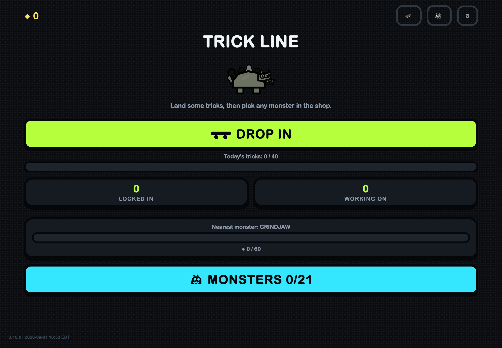
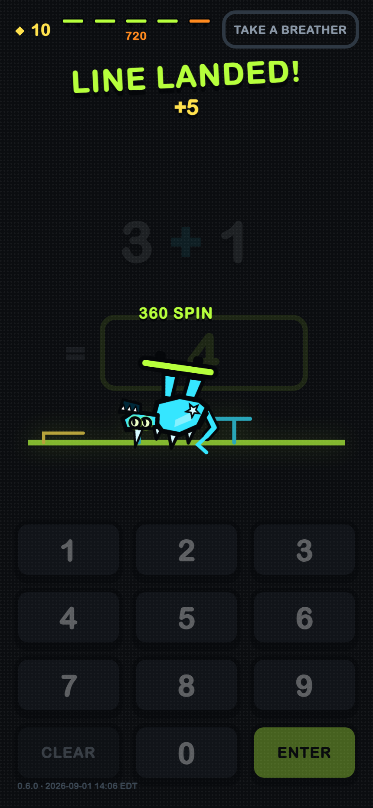
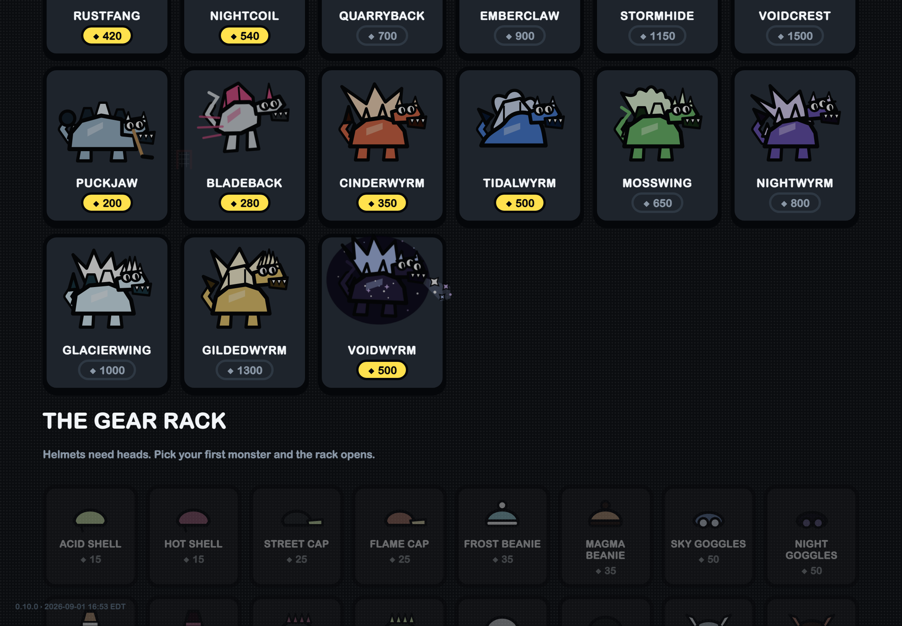
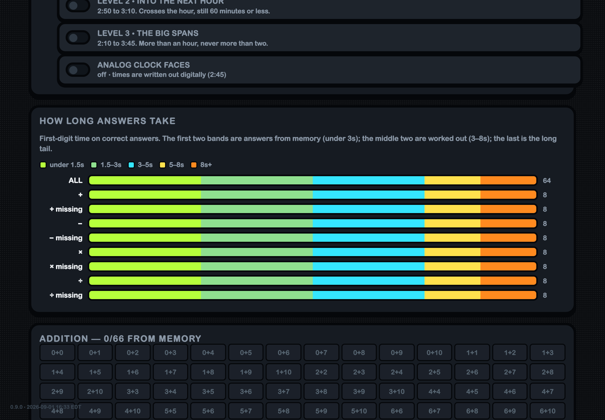

# TRICK LINE

**A math fact fluency PWA for one particular third grader — skate tricks, original kaiju, and a scheduler that honours how he actually thinks.**

Built for a boy who can *derive* any fact (11 − 8 by bridging through ten, talking himself through it) but can't yet *retrieve* them instantly — the gap that turns into a wall when 4th-grade long division demands facts on tap. The app's whole design is one idea:

> **Correctness and automaticity are different measurements.** The learner is credited on correctness — a worked-out answer earns full points, the same trick, the same coins, indistinguishable on screen. The scheduler promotes on latency — only answers faster than 3 seconds (measured to the *first digit*, so his typing speed is never mistaken for his memory) move a fact up the spaced-repetition ladder. He experiences a generous game; the scheduler quietly runs a strict one.

## How it plays

- **Trick Line**: every correct answer lands the next skate trick. Five tricks land a line — and his monster rides the whole line start to finish while the park lights up.
- **A Leitner scheduler** (7 boxes, 1 to 64 days) with placement-on-first-sight, an anti-drowning gate on new facts, interleaving within priority bands, a fatigue detector that offers the exit early when the clock creeps, and mastery only after three fast recalls on three separate days. Once a week the session opens with an unannounced **cold check** of mastered facts, reported as its own series.
- **Wrong answers can't be skipped** — a warm scaffold shows *his own* bridge-through-ten strategy back to him, then he types the correct answer himself. No red X, no buzzer, ever.
- **A daily dose** (parent-set) with a fanfare, a stamped badge, and everything after it labelled extra practice.
- **The Skate Park**: finishing the day's dose drops a Daily Token; a token buys a few minutes (a parent dial) in a pure touch skateboarding game with the rider's own monster, board and helmet. Tap to ollie, hold for bigger, swipe for tricks, grind rails, chain for multipliers, bail if you land early. A parent cap on tokens per day keeps it a reward, not an afternoon.
- **The shop**: 34 original monsters (a Komodo dragon among the early saves, a striker in a number 7 shirt, an excavator, a ninja, a dark knight; seven dragons, each a different form with a different breath; eight hybrid kaiju, among them a hoops-shooting tower, a jet pilot, a moon-howling wolf, a three-headed hydra, a skyscraper-wrecking wolf-dragon, a gold-clawed panther), 34 helmets (sports lids, a hard hat, a ninja band and a great helm among them), 17 boards (a plain one always yours, sixteen to save for, each with its own deck graphic and a trail while it rides; among them a fighter jet with a cockpit nose, a hockey rink, a basketball court, and a graffiti tag), all with in-character idle acts — boulders fall for the quarry beast, the storm titan gets rained on, the night serpent vanishes while his trophy relocates.
- **Speed Run**: one minute, as many as you can — budgeted per day, with per-setup high scores, and firewalled from the practice telemetry.

## The parent side

Behind a PIN, in two tabs. **Progress**: retrieval-vs-derivation trend by week, the cold-check series, the two Virginia standards, his personal floor and a response-time histogram whose buckets nest inside the classification, tomorrow's queue from the real planner, per-operation summary bars with the fact grid on request, and a stamina log that names how every run ended. **Settings**: a four-row practice table (on, missing-number, cap), the daily dose and speed-run budget, the elapsed-time ladder, riders (several children on one iPad, each with their own data), backup and CSV export that carries its own measurement definition, and an anonymous **cloud share code** (QR). A phone or laptop linked to a code views the record read-only without loading it over its own data, and parents and teachers have their own front door at **`/parent/`**: no PIN, no game, any number of riders remembered by code, QR or backup file. From there a parent can also **set what the rider works on** (operations, caps, missing number, the daily dose, the speed budget, the elapsed ladder): each dial is a stamped field merged in the cloud, and the rider's device applies newer fields when it opens, saying so in a toast. A **Trends** tab on both sides measures improvement week by week, with a projection per standard that calls itself a projection. The iPad remains the gold standard; the cloud is a throttled, never-blocking mirror.

## Under the hood

- Vite + TypeScript, **no framework, no canvas library** — the entire app is vanilla DOM and inline SVG. Every creature is a parameter set through one renderer; every sound is synthesized WebAudio. No image or audio assets ship at all, so the offline bundle is ~60 KB gzipped.
- **Installable PWA, fully offline**: hand-written service worker with a build-generated precache, IndexedDB with a rejected-not-coerced schema version.
- **Verification culture inherited from a family of shipped games**: 130+ unit tests, deliberate-mutation checks that prove the tests bite, a 200-day simulation of the learner, and eleven Playwright "senses" including `answer-eye`, which re-derives every graded answer with a second independent implementation, drives real touches, and reads the screenshots back. The release gate deploys only from green and polls the live edge to convergence; an `alpha` branch publishes to its own preview channel through the same gate.
- Aligned to the **Virginia SOL**: closing the grade-2 automaticity standard (2.CE.1) while building toward grade-3's (3.CE.2).

Built by a dad and [Claude Code](https://claude.com/claude-code), in a day, from field reports sent between homework and bedtime.
